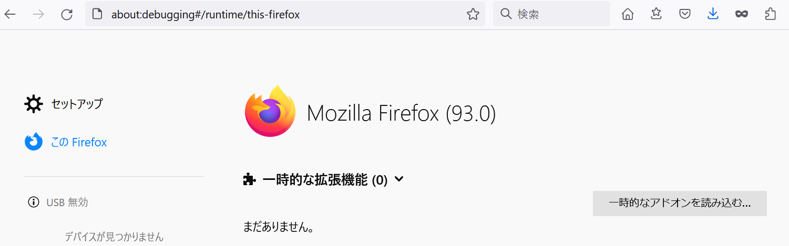

# YNU-LMS-Extension_Fox v1.0

未実施の課題・テスト情報を取得して、LMSに一覧表示するFirefoxアドオンです。

:warning: **提出期限までの日数が15日以上あるものは表示されません。**

## 導入方法
1. 右上にある緑色の`Code`ボタンを押したあと、`Download ZIP`をクリック

2. ZIPファイルを自分の好きな場所にダウンロードし、解凍する
3. Mozilla Firefoxを起動して、`デバッガー`（about:debugging#/runtime/this-firefox） にアクセス
4. `一時的なアドオンを読み込む…`をクリック

5. `ステップ2`で解凍したフォルダを選択する
6. `manifest.json`を選択し`開く`をクリック

7. アドオンの一覧に、`YNU-LMS Extension Fox`が追加されていれば成功です

## 注意事項
kurikin氏作のChrome拡張機能をFirefoxに対応させたものです。
大学非公式のツールです。自己責任で使用してください。

正式版Firefoxでは未署名のパッケージ化されたアドオンのインストールができないようになっています。起動の度に導入作業が必要です。
Developer Editionを使うと、未署名のアドオンがインストールできます。その際はzipファイルの階層構造に注意してください。
